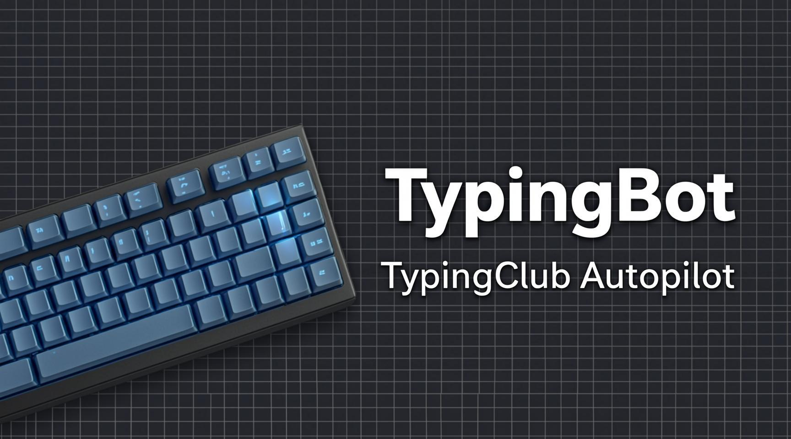
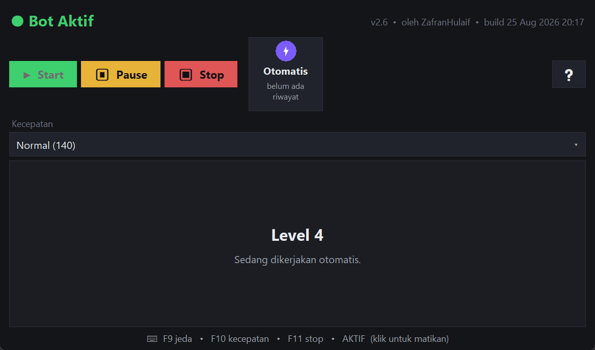
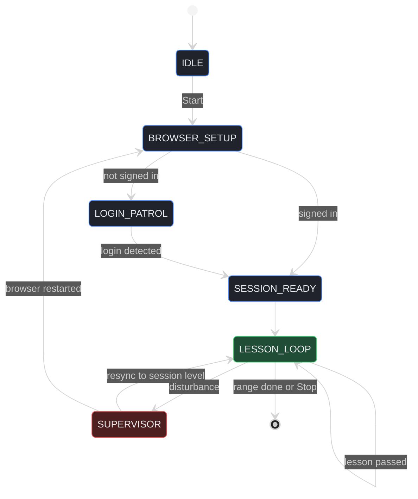
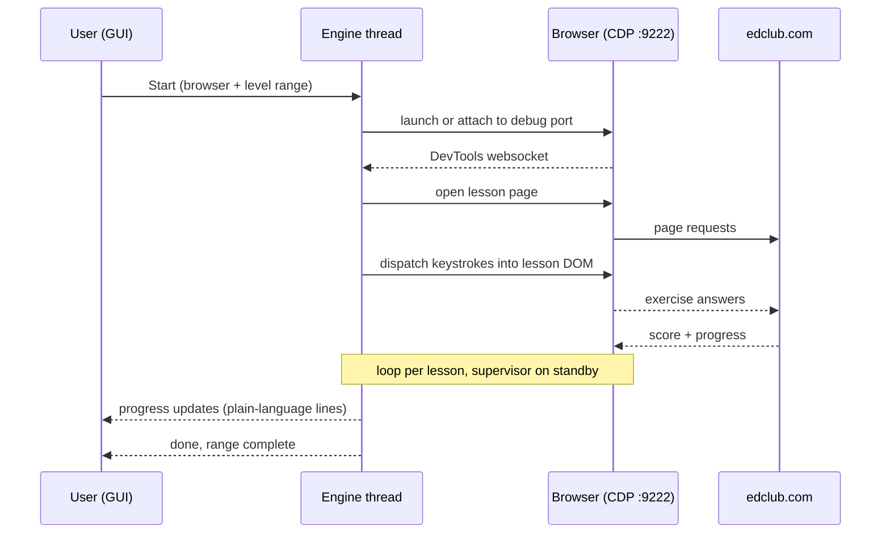

# TypingClub Autopilot (TypingBot)




A fully autonomous agent that completes TypingClub (edclub.com) typing courses
end-to-end inside a **real browser**, supervised by a self-healing state
machine that survives human interference. ~9,700 lines of Python across three
engine generations, shipped to end users as a single-file Windows executable
with machine-locked activation.

<p align="center">
  
</p>

> **Disclaimer.** This project automates a third-party website and almost
> certainly violates TypingClub's terms of service. It is published for
> educational and portfolio review only. See the [license](#license).
> "TypingClub" and "edclub.com" are trademarks of their respective owners;
> this project is not affiliated with them.

## Highlights

- **DOM-level automation over the Chrome DevTools Protocol.** The agent
  attaches to a real Brave / Chrome / Edge instance on port 9222 and dispatches
  keyboard events straight into the lesson player's DOM. No screenshots, no
  OCR, no pixel math: CPU usage stays near zero and it works in background
  tabs. If another app already occupies 9222, the agent silently moves to the
  next free port instead of asking the user to close it.
- **Self-healing supervisor.** A human grabbing the keyboard makes the bot
  yield and stand by until the machine is idle again. Lost tab → reattach,
  lost focus → refocus, stalled lesson → watchdog recovery, signed out →
  re-login patrol. After any disturbance it resyncs to the *session's* lesson
  level instead of the account frontier, so it never silently skips ahead.
- **Full course roadmap baked in.** A 685-lesson map is embedded at build
  time; users can run a custom level range, resume where they left off, or
  pick a start lesson directly in the browser.
- **Any browser profile.** The launcher can drive the user's *own* Chrome /
  Edge / Brave profile. Since Chromium 136 refuses remote debugging on a real
  user-data directory, the bot transparently creates an NTFS directory
  junction to it: the browser sees its genuine profile, the debugger sees a
  "custom" one.
- **Machine-locked activation.** The exe derives a hardware fingerprint
  (MAC + hostname + volume serial → SHA-256 → base32 machine code) and
  unlocks against an HMAC-SHA256 challenge key issued per machine. The
  signing secret lives outside this repository.
- **Plain-language desktop UI.** A tkinter front end with a translation
  layer that converts technical engine output into friendly activity lines,
  so non-technical users never see port numbers, PIDs, or log paths.

## State machine

The engine is a supervised loop rather than a linear script. Any disturbance
hands control to the supervisor, which repairs the situation and resyncs to
the lesson the session was already working on.



What the supervisor handles:

| Disturbance | Response |
|---|---|
| Human starts typing | yield and stand by until the machine is idle |
| Lesson tab closed or lost | reattach or reopen the session level |
| Focus stolen by another tab | refocus the lesson element |
| Lesson stalled or frozen | watchdog recovery |
| edclub session signed out | re-login patrol, then resume |

## How a session runs



## Repository layout

```
engine/                     automation engine (was one 4,600-line file)
  config.py                 constants: browser candidates, speeds, URLs
  state.py                  shared mutable state, one namespace
  hotkeys.py                global F9/F10/F11 hooks
  browser.py                debug port, launch, CDP connect, tab management
  profiles.py               profile enumeration + junction trick
  jsutil.py                 frame/JS helpers, popup & premium-modal handling
  typing_core.py            CDP keystrokes, delays, user-activity watcher
  lessons/                  one driver per lesson type
    standard.py tutorial.py games.py holdkey.py
    screenkey.py video.py intro.py ocr.py
  recovery.py               dead page / wrong tab / renderer repair
  levels.py                 level map, ranges, list navigation
  session.py                login patrol & session detection
  rentang.py                per-iteration range check
  supervisor.py             the main supervisor loop
autopilot_pw.py             compatibility facade over the package
bot_gui.py                  desktop front end: dialogs, activity view,
                            activation, launcher
level_data.py               baked 685-lesson course map
version1_selenium.py        v1 engine (Selenium, kept for history)
version2_playwright.py      v2 engine (Playwright, kept for history)
```

The version history is deliberate: the repository doubles as a record of how
the architecture evolved.

## Evolution

1. **v1: Selenium.** Drove a dedicated browser instance by CSS selectors.
   Brittle to UI changes, could not reach the user's daily browser, and the
   typing approach burned CPU.
2. **v2: Playwright.** Replaced selector scraping with page-level event
   injection. Faster and stabler, but still coupled to a browser it owned.
3. **v3: CDP supervisor (current).** Attaches to *any* real browser over the
   DevTools protocol, including the user's own profile, and wraps the whole
   run in a resilience layer: collision handling, focus/tab recovery, login
   patrol, session-level resume, and a plain-language GUI. Distributed as a
   single-file exe with machine-locked activation.

## Tech stack

| Layer | Choice |
|---|---|
| Language | Python 3.14 |
| Browser automation | Playwright over Chrome DevTools Protocol (port 9222) |
| Browsers driven | Brave, Google Chrome, Microsoft Edge (any profile) |
| Desktop UI | tkinter (custom dark theme, bilingual-friendly strings) |
| Concurrency | Engine thread + GUI poll loop |
| Licensing | `hashlib` / `hmac` hardware-fingerprint challenge keys |
| Packaging | PyInstaller `--onefile --windowed`, ~58 MB exe |
| Platform | Windows 10/11 |

## Running from source

```bash
pip install playwright
python bot_gui.py
```

The app requires an activation key bound to the machine code it displays on
first run. Keys are issued by the author per machine; the license below does
not grant a right to run the software. Note that the public source ships
with a **placeholder** signing secret, so self-built binaries can neither
forge nor validate activation keys.

## License

Published as **source-available for educational and portfolio review**.
You may read and reference the code, but running, redistributing, or using it,
commercially or not, requires prior written permission. See
[LICENSE](LICENSE).
